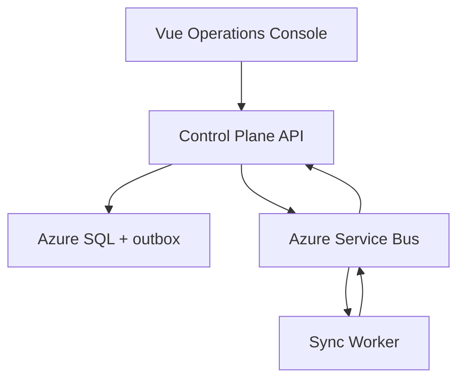

# RelayWorks Integration Platform

RelayWorks is a .NET and Vue reference platform for reliable customer-system integrations. Iteration 2 demonstrates an asynchronous construction/payroll workflow across independently deployable Control Plane and Sync Worker services.

## Implemented vertical slice

1. An operator submits a tenant-scoped time-entry export through the Vue console.
2. The Control Plane saves the integration run and an outbox message in one Azure SQL transaction.
3. The outbox publisher sends an `IntegrationRunRequestedV1` command to Azure Service Bus.
4. The Sync Worker maps representative source records into `CanonicalTimeEntryV1` and validates them.
5. The Worker publishes accepted/rejected counts as an `IntegrationRunCompletedV1` event.
6. The Control Plane consumes that event and updates the durable run state.
7. Repeated submissions are constrained by a tenant/idempotency-key unique index.

The source and destination connectors are simulations. RelayWorks does not claim a production FieldFlo, Sage, QuickBooks, or other vendor connector.

## Architecture



The services share only versioned integration contracts. The Worker does not reference the Control Plane domain, application, or infrastructure projects.

## Repository layout

```text
src/
  RelayWorks.ControlPlane.Api/  HTTP boundary and hosted message processes
  RelayWorks.Application/       Control Plane use cases and ports
  RelayWorks.Domain/            Control Plane domain and invariants
  RelayWorks.Infrastructure/    Azure SQL, EF Core, outbox, Service Bus
  RelayWorks.Contracts/         Versioned inter-service contracts
  RelayWorks.Sync.Worker/       Time-entry processing service
tests/
  RelayWorks.Domain.Tests/
  RelayWorks.Sync.Worker.Tests/
web/relayworks-console/          Vue 3 + TypeScript operations console
infra/                           Terraform bootstrap, modules, and dev environment
docs/                            Architecture and decisions
```

## Technology

- .NET 10 and ASP.NET Core
- Vue 3, TypeScript, and Vite
- EF Core 10 and Azure SQL
- Azure Service Bus
- Azure Container Apps and Container Registry
- Terraform with the AzureRM provider
- Managed identities and private Azure SQL networking

## Local validation

```bash
dotnet restore RelayWorks.slnx
dotnet build RelayWorks.slnx --configuration Release
dotnet test RelayWorks.slnx --configuration Release

cd web/relayworks-console
npm ci
npm run build

cd ../../infra/environments/dev
terraform init -backend=false
terraform validate
```

Local Control Plane execution requires a SQL Server connection string. Messaging is disabled in `appsettings.Development.json`; submitted commands remain in the outbox until messaging is enabled. See `infra/README.md` for Azure deployment prerequisites.

## Status

| Capability | Status |
| --- | --- |
| Control Plane and Sync Worker deployables | Implemented |
| Tenant-scoped idempotency | Implemented |
| Azure SQL EF model and initial migration | Implemented, not deployed |
| Transactional outbox and publisher | Implemented |
| Service Bus command/event round trip | Implemented |
| Canonical time-entry contract and validation | Implemented with simulated records |
| Terraform Azure dev environment | Implemented, not applied |
| Vue operations console | Implemented |
| Record-level reconciliation storage | Planned |
| Real vendor connectors | Planned |
| OpenTelemetry instrumentation | Planned |

RelayWorks is a portfolio/reference implementation, not a production integration product.
