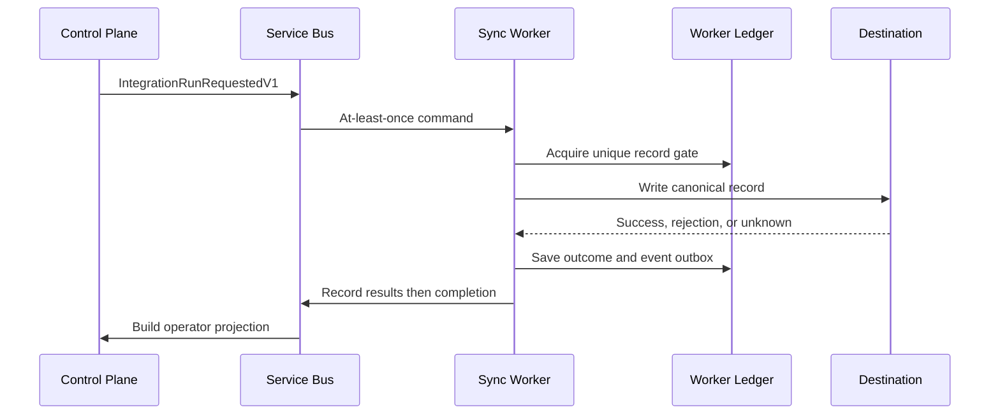

# RelayWorks Architecture

## Service boundaries

| Service | Owns | Does not own |
| --- | --- | --- |
| Control Plane | run lifecycle, tenant idempotency, command outbox, operator read projections and resolutions | connector execution or Worker ledger |
| Sync Worker | command inbox, canonical mapping, delivery ledger, connector execution, event outbox | Control Plane database or operator state |

The shared `RelayWorks.Contracts` assembly contains versioned messages and canonical transfer contracts only.

## Identity boundary

The Vue console acquires a delegated Control Plane token with MSAL. The API requires a signed `relayworks_tenant_id` claim before tenant-scoped handlers execute and applies `Integration.Operator` or `Integration.Admin` app-role policies to mutations. Tenant identifiers are absent from mutation DTOs; the authenticated context supplies them. Development bypass is explicit and fixed to one configured tenant.

## Record-safe time-entry flow

## Delivery semantics

- Inbox identity makes a fully processed command a no-op on redelivery.
- The record key `(tenant, connection, operation, source id, source version)` is unique.
- The gate is persisted before the destination call.
- Terminal rows prevent a second destination call.
- An interrupted or timed-out call becomes `UnknownOutcome`, never an automatic retry.
- Worker events use a transactional outbox; Control projections use a natural unique key and upsert.
- Connection capabilities are snapshotted into each command; only proven no-commit failures are retryable.
- Read-after-write recovery can convert an unknown outcome to success only when the connector proves the destination record exists.
- The Worker resolves a structured Key Vault locator once per run through a coalescing five-minute cache.
- Vault routing can be overridden per tenant or region without changing message contracts.
- Connection tests are durable commands executed by the Worker; the console polls their Control Plane projection.
- W3C trace context crosses Service Bus in application properties, while run/test IDs remain explicit business correlation.
- Low-cardinality metrics describe outbox lag, connector duration, record outcomes, and cache behavior without tenant or secret dimensions.
- A replica-wide, per-connection token bucket and concurrency gate protect each destination across simultaneous runs; Terraform holds the Worker at one replica until coordination is distributed.
- Exponential backoff, jitter, and `Retry-After` are honored only after a connector proves the prior request did not commit.
- Repeated confirmed failures open a per-connection circuit; ambiguous outcomes still go directly to reconciliation.
- Operator queries use tenant-prefixed composite indexes and opaque `(timestamp, ID)` keyset cursors; page size is bounded to 100.
- Record status views are evaluated in SQL, preventing successful record histories from being downloaded merely to display exceptions.

This is not exactly-once delivery. It is an explicit duplicate-avoidance protocol with a human reconciliation path for unknowable external outcomes.

## Record states

| State | Meaning | Automatic action |
| --- | --- | --- |
| `Processing` | Gate acquired; connector call in progress | Continue current attempt only |
| `Succeeded` | Destination confirmed commit | None |
| `Rejected` | Deterministic validation/business rejection | Correct source or mapping |
| `RetryableFailure` | Confirmed no-commit transient failure | Retry policy planned |
| `UnknownOutcome` | Commit may have occurred | Stop; operator verification required |
| `ManuallyResolved` | Operator documented disposition in read projection | None |

## Data ownership

Terraform provisions two databases on the same private Azure SQL logical server. Sharing the server controls cost; separate databases preserve service ownership. Managed identities authenticate each Container App. Schema migrations run in an approved deployment job rather than Terraform provisioners.

## Remaining production work

- Replace simulated adapters with FieldFlo and accounting/payroll connectors.
- Add tenant-isolation and app-role integration tests.
- Define connector-specific read-after-write and reconciliation capabilities.
- Add ledger retention policy and failure-injection tests.
- Replace in-process waits with durable Service Bus scheduling for provider-requested delays longer than the bounded retry window.
