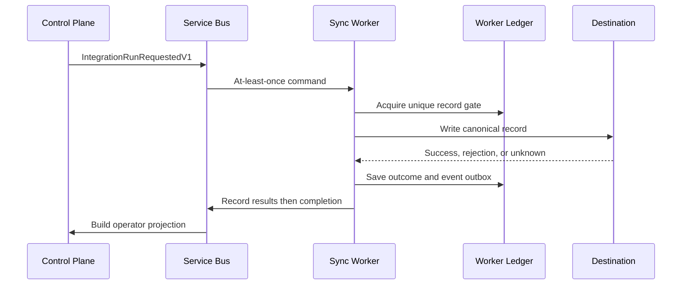

# RelayWorks Architecture

## Service boundaries

| Service | Owns | Does not own |
| --- | --- | --- |
| Control Plane | run lifecycle, tenant idempotency, command outbox, operator read projections and resolutions | connector execution or Worker ledger |
| Sync Worker | command inbox, canonical mapping, delivery ledger, connector execution, event outbox | Control Plane database or operator state |

The shared `RelayWorks.Contracts` assembly contains versioned messages and canonical transfer contracts only.

## Record-safe time-entry flow

## Delivery semantics

- Inbox identity makes a fully processed command a no-op on redelivery.
- The record key `(tenant, connection, operation, source id, source version)` is unique.
- The gate is persisted before the destination call.
- Terminal rows prevent a second destination call.
- An interrupted or timed-out call becomes `UnknownOutcome`, never an automatic retry.
- Worker events use a transactional outbox; Control projections use a natural unique key and upsert.
- Connection capabilities are snapshotted into each command; only proven no-commit failures are retryable.
- Read-after-write recovery can convert an unknown outcome to success only when the connector proves the destination record exists.

This is not exactly-once delivery. It is an explicit duplicate-avoidance protocol with a human reconciliation path for unknowable external outcomes.

## Record states

| State | Meaning | Automatic action |
| --- | --- | --- |
| `Processing` | Gate acquired; connector call in progress | Continue current attempt only |
| `Succeeded` | Destination confirmed commit | None |
| `Rejected` | Deterministic validation/business rejection | Correct source or mapping |
| `RetryableFailure` | Confirmed no-commit transient failure | Retry policy planned |
| `UnknownOutcome` | Commit may have occurred | Stop; operator verification required |
| `ManuallyResolved` | Operator documented disposition in read projection | None |

## Data ownership

Terraform provisions two databases on the same private Azure SQL logical server. Sharing the server controls cost; separate databases preserve service ownership. Managed identities authenticate each Container App. Schema migrations run in an approved deployment job rather than Terraform provisioners.

## Remaining production work

- Replace simulated adapters with FieldFlo and accounting/payroll connectors.
- Add authentication, authorization, tenant isolation tests, and immutable resolution audit actors.
- Define connector-specific read-after-write and reconciliation capabilities.
- Add OpenTelemetry, alerting, ledger retention policy, and failure-injection tests.
