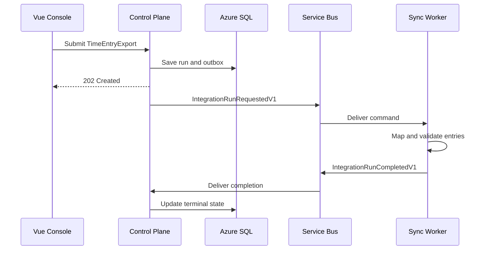

# RelayWorks Architecture

## Service boundaries

RelayWorks uses two independently deployable services in Iteration 2.

| Service | Owns | Does not own |
| --- | --- | --- |
| Control Plane | tenants, connections, run lifecycle, idempotency, outbox, operator API | vendor payload processing |
| Sync Worker | command consumption, canonical mapping, validation, connector execution | Control Plane database or domain |

The shared `RelayWorks.Contracts` assembly contains versioned messages and canonical transfer contracts only. It contains no persistence or business-service implementation.

## Time-entry export sequence

## Delivery semantics

The workflow is at-least-once:

- The outbox prevents the database/message dual-write gap.
- The outbox message id becomes the Service Bus message id.
- Terraform enables Service Bus duplicate detection.
- The tenant/idempotency-key index prevents duplicate run creation.
- The result consumer treats repeated terminal completion events as successful no-ops.

This design does not claim exactly-once delivery. Future connector calls require destination idempotency or a durable processed-record ledger.

## Canonical time entry

`CanonicalTimeEntryV1` deliberately contains a narrow set of cross-system fields: tenant, source identity/version, employee, project, work date, regular/overtime hours, labor code, and correlation id. Vendor payloads remain inside connector adapters.

Iteration 2 creates deterministic representative records inside the Worker. Every tenth entry omits its project reference and is rejected with a stable validation rule. Record-level error persistence is planned for Iteration 3.

## Azure deployment

Terraform provisions a private-networked Container Apps environment, Azure SQL private endpoint, Service Bus, identities, registry, Key Vault, and observability resources. Managed identities authenticate application services. EF migrations are run by an approved deployment job, not a Terraform provisioner.

## Known next work

- Persist record-level validation and reconciliation issues.
- Add mapping profiles and connection configuration.
- Add simulated source/destination connector ports rather than generating records in the processor.
- Instrument traces, metrics, and logs with OpenTelemetry.
- Add retry classification and an operator recovery workflow.
