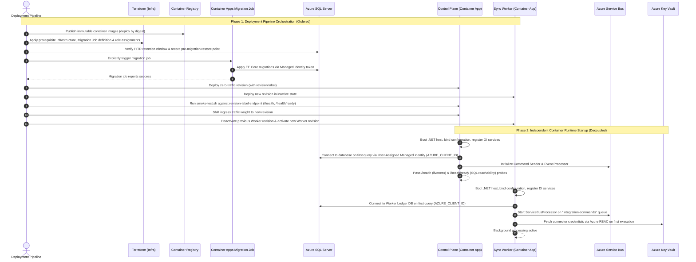

# Deployment and rollback

CI must pass NuGet Audit during restore, .NET tests (including SQL Server Testcontainers and migrations), the Vue production build, and Terraform formatting/validation. High or critical advisories are corrected by upgrading or explicitly pinning a patched compatible dependency; they are not suppressed. Deployment uses Azure workload identity federation; long-lived client secrets are not required.

The deployment workflow creates a Terraform plan under a protected GitHub environment and preserves it as a short-lived immutable artifact. Applying infrastructure is intentionally a separate approval boundary. Container images should be addressed by digest, and database migration bundles should run from an approved job before application traffic moves to the new revision.

## Terraform state backend bootstrap

Remote state for environment modules is hosted in an Azure Blob Storage container (`tfstate`) within a dedicated state resource group (`rg-relayworks-tfstate`).

The state backend storage account is provisioned via `infra/bootstrap/state` and enforces authoritative recovery protections:
- Microsoft Entra ID authentication (`default_to_oauth_authentication = true`, `use_azuread_auth = true`) with shared access keys and local users disabled (`shared_access_key_enabled = false`, `local_user_enabled = false`).
- Blob versioning enabled (`versioning_enabled = true`).
- 30-day soft deletion retention for both individual blobs and containers.
- Private blob container access (`container_access_type = "private"`).

Environment deployments reference this state account using environment-specific `backend.hcl` files.

## Recommended production promotion workflow

1. **Build and publish immutable images**: Build and scan Control Plane, Worker, and Migration Job container images. Images are tagged with the commit SHA for traceability and deployed by immutable digest.
2. **Produce and approve Terraform plan**: Generate and review the Terraform plan for prerequisite infrastructure and application configuration under a protected pipeline gate.
3. **Apply prerequisite infrastructure**: Apply baseline infrastructure (networking, Azure SQL, Key Vault, Service Bus, Container Apps environment, Migration Job definition, Managed Identities, and RBAC role assignments) without routing traffic to new application revisions.
4. **Verify database recovery posture**: Verify the Azure SQL point-in-time restore (PITR) retention window and record the pre-migration restore point timestamp. For high-risk migrations, create a database copy, export, or other independently reviewed recovery artifact.
5. **Run and monitor the migration job**: Trigger and monitor the dedicated Azure Container Apps Migration Job (`caj-relayworks-migrations-...`) to apply EF Core migration bundles via user-assigned managed identity.
6. **Deploy zero-traffic application revisions**:
   - Deploy the Control Plane revision with zero ingress traffic weight (`Multiple` revision mode during rolling deployments).
   - Deploy the Worker revision with its scaling configuration preconfigured but keep the revision inactive.
7. **Smoke-test zero-traffic revision**: Run `scripts/smoke-test.sh` against the new Control Plane revision using the revision-label endpoint returned by Azure to verify `/health` liveness and `/health/ready` database reachability.
8. **Shift Control Plane traffic and activate Worker**:
   - Shift ingress traffic weight to the new Control Plane revision (or switch active revision).
   - After Control Plane promotion succeeds, deactivate the previous Worker revision and activate the new Worker revision, whose Service Bus scaling rule is already configured. (If operating in a rolling transition window with both Worker revisions briefly active as competing consumers, both revisions must maintain backward and forward compatibility across database schemas and message contracts).
9. **Observe operational metrics**: Monitor exception rates, dead-letter queues, command outbox lag, and connector circuit breakers before decommissioning previous revisions or closing the promotion window.

Rollback application revisions before attempting schema rollback. EF down-migrations can destroy data and require a separate reviewed recovery plan. Additive database changes should remain compatible with the prior application revision for at least one deployment window. Archive deletion must remain in dry-run mode through initial deployment and one complete retention cycle.

## Azure Startup & Runtime Lifecycle

> "RelayWorks has three separate startup lifecycles: infrastructure provisioning through Terraform, schema deployment through a private Container Apps migration job, and runtime startup of independently scalable Control Plane and Worker containers. Managed identities provide passwordless access to SQL, Service Bus, and Key Vault. The deployment pipeline enforces migration ordering; the applications themselves remain independently restartable and do not rely on startup order."

### 1. The Three Distinct Lifecycles

Understanding startup in Azure requires distinguishing **infrastructure provisioning**, **deployment pipeline orchestration**, and **runtime container startup**:

1. **Infrastructure Provisioning (Terraform)**: Provisions Azure SQL, Service Bus, Key Vault, Container Apps environment, Migration Job definition, ACR, User-Assigned Managed Identities (`id-relayworks-...`), networking private endpoints, and Static Web Apps. In Azure, `DefaultAzureCredential` is explicitly directed to the intended user-assigned identity by injecting `AZURE_CLIENT_ID` into each container's environment variables.
2. **Deployment Orchestration (CI/CD Pipeline)**: Publishes immutable container images to ACR by digest, applies infrastructure changes, explicitly triggers and monitors the private Container Apps Migration Job to apply EF Core migrations, deploys zero-traffic Control Plane / inactive Worker revisions, executes smoke tests via revision labels, shifts Control Plane ingress traffic, and activates the new Worker revision while deactivating the previous one.
3. **Runtime Container Startup (Independent Workloads)**: Each Container App (.NET host) starts up independently, loads configuration, lazily acquires Entra ID tokens on first access via `DefaultAzureCredential` (using `AZURE_CLIENT_ID`), and serves traffic or processes messages without relying on coordinated startup order with other services.

### Cloud Architecture & Components

| Component | Azure Resource | Execution & Auth Model |
| --- | --- | --- |
| **Control Plane API** | Azure Container App (`ca-relayworks-control-...`) | ASP.NET Core API (.NET 10). Initializes command outbox publisher (`ServiceBusSender`) and event subscription processor (`ServiceBusProcessor`). Authenticates to Azure SQL and Service Bus via User-Assigned Managed Identity (`id-relayworks-control-...`, resolved via `AZURE_CLIENT_ID`). Enforces Entra ID JWT bearer authorization. |
| **Sync Worker** | Azure Container App (`ca-relayworks-worker-...`) | Background worker service. Registers a `ServiceBusProcessor` receiver on the `integration-commands` queue (SDK-managed receive loop). Uses User-Assigned Managed Identity (`id-relayworks-worker-...`, resolved via `AZURE_CLIENT_ID`) for SQL, Service Bus, and Key Vault RBAC access. |
| **Database Migrations** | Azure Container Apps Job (`caj-relayworks-migrations-...`) | Dedicated on-demand container job executing EF Core migrations within the private virtual network before application traffic routes to new revisions. |
| **Vue Operations Console** | Azure Static Web Apps (`swa-relayworks-...`) | Globally distributed static SPA deployed independently. Starts in the browser and acquires user tokens via MSAL against Entra ID App Registrations. |
| **Data Storage** | Azure SQL (Private Endpoint) | Isolated databases (`relayworks-control` and `relayworks-worker`). Contained database users map directly to service managed identities. |
| **Messaging** | Azure Service Bus Namespace | Standard tier namespace with `integration-commands` queue and `integration-events` topic. |
| **Secrets Management** | Azure Key Vault (`kv-relayworks-...`) | Stores third-party connector tokens and credentials; resolved at runtime by the Worker via Azure RBAC (`Key Vault Secrets User` role). |

### Deployment & Runtime Sequence

### Key Architectural Characteristics

- **Pipeline-Enforced Ordering**: Azure Container Apps does not natively coordinate start order between jobs and apps. The deployment pipeline explicitly sequences migration completion before shifting application traffic or activating worker consumption.
- **User-Assigned Identity Resolution (`AZURE_CLIENT_ID`)**: `DefaultAzureCredential` resolves the specific user-assigned managed identity via the configured `AZURE_CLIENT_ID` environment variable, acquiring tokens just-in-time upon first resource access.
- **SDK-Managed Processing**: Worker message processing uses the Azure Service Bus SDK's `ServiceBusProcessor` rather than application-level loop polling.
- **Worker Lifecycle & Activation**: The Worker does not receive HTTP traffic. It is deployed in an inactive state and activated after Control Plane promotion by deactivating the previous Worker revision and activating the new Worker revision (whose Service Bus scaling rule is already configured). When multiple Worker revisions run concurrently during transitions, strict forward/backward message and schema compatibility is maintained.
- **Health vs. Operational Signals**: `/health` serves as a basic liveness probe, while `/health/ready` verifies core database connectivity. Outbox backlog metrics are treated as operational signals/metrics rather than hard readiness blocks to prevent cascading downtime under heavy load.
- **Azure RBAC Secrets Resolution**: Key Vault access uses Azure RBAC role assignments (`Key Vault Secrets User`) without legacy access policies.
- **Independent Scale-to-Zero & Cold Starts**: Under scale-to-zero configurations (e.g. dev environment), inbound HTTP requests or KEDA Service Bus queue activation cause Azure to instantiate replicas on demand, boot .NET, satisfy probes, and process work.

### Local Development vs. Azure Runtime

| Characteristic | Local Development (`scripts/start-local-dev.ps1`) | Azure Production / Dev Environment |
| --- | --- | --- |
| **Authentication** | Disabled (`Authentication:Enabled=false`), fixed dev tenant GUID | Microsoft Entra ID OAuth2 / OIDC with App Roles (`Integration.Admin`, `Integration.Operator`) |
| **Database Credentials** | SQL Server container with `sa` user & password | Azure SQL with User-Assigned Managed Identities (`AZURE_CLIENT_ID`, passwordless) |
| **Service Bus** | Azure Service Bus Emulator container (ports `5300`/`5672`) | Azure Service Bus Namespace with Azure RBAC data roles |
| **Migrations** | Local PowerShell script (`run-migrations.ps1`) | Azure Container Apps Job within private virtual network triggered by release pipeline |
| **Secrets Resolution** | Mock secret references / local environment | Azure Key Vault with Azure RBAC and cached secret locator resolution |
| **Scaling Policy** | Fixed local developer processes | Dynamic scaling / Scale-to-zero via KEDA (HTTP and queue depth triggers) |

